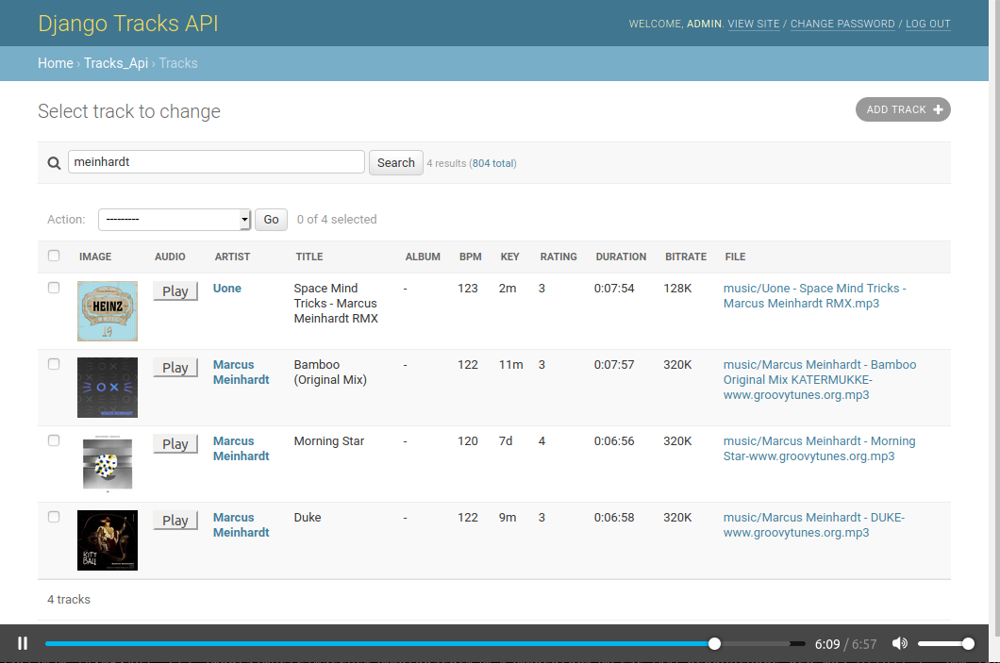

# django-tracks

[](https://travis-ci.com/wolkenarchitekt/django-tracks-api)

A Django based REST API for your music tracks

Features
--------

* import audio files (supports at least MP3, AAC, FLAC, OGG, ASF, AIFF) into Django DB.
* Can read all audio tags that [Mediafile](https://github.com/beetbox/mediafile) supports 
* Admin UI to list, show and filter tracks by tags
* *In progress: Django REST framework powered API*

Quickstart
----------

Install Django tracks API::

```shell script
pip install django-tracks-api
```

Add it to your `INSTALLED_APPS`:

```python
INSTALLED_APPS = (
    ...
    'tracks_api',
    ...
)
```

Create Django admin user:

```shell script
python manage.py createsuperuser
```

Add Django tracks API's URL patterns:

```python
import tracks_api


urlpatterns = [
    ...
    path("tracks/", include(tracks_api.urls.router.urls)),
    ...
]
```
Run `python manage.py migrate` to create tracks API models.

Run Django server:

```shell script
python manage.py runserver
```

Screenshots
-----------


